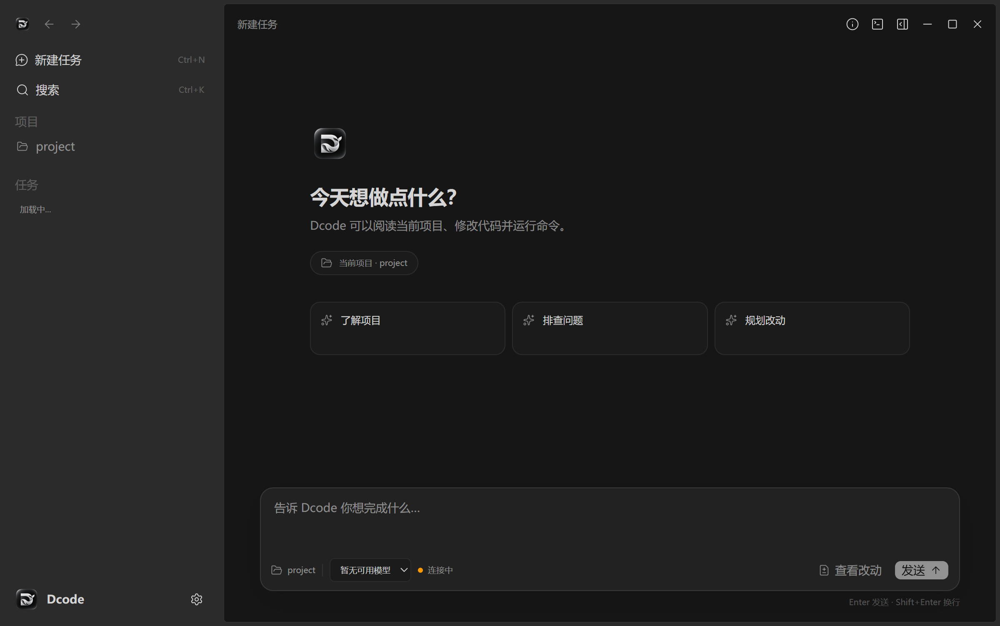
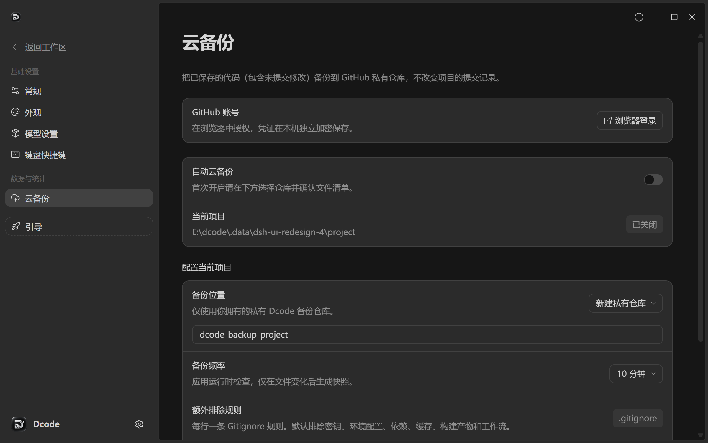

<div align="center">
  
  <h1>Dcode</h1>
  <p>An open-source coding desktop combining a ZCode-based workspace, DeepSeek Harness, and private GitHub snapshot backups.</p>
  <p><a href="README.md">简体中文</a> · <a href="docs/CLOUD-BACKUP.md">Backup guide</a> · <a href="docs/DSH-INTEGRATION.md">DSH integration</a> · <a href="CONTRIBUTING.md">Contribute</a></p>
</div>



Dcode is an independent derivative of [ZCode](https://github.com/zai-org/ZCode). Its desktop coding experience uses [DeepSeek Harness](https://github.com/ningbainb/deepseek-harness-desktop) as the local Agent runtime. You can work with a project, chat with an Agent, inspect tool activity, edit files, run commands, review Git diffs, and resume DSH sessions from the sidebar. Dcode is not an official release of either upstream project.

## GitHub cloud backup

The Windows desktop app can capture **saved, uncommitted changes** as separate snapshots in a **private repository owned by the connected GitHub account**. This includes staged, unstaged, and untracked files that Git does not ignore. It leaves the source project's commits, index, and remotes untouched. Setup requires a local Git project, Git for Windows with Git Credential Manager, a browser sign-in, file preview, and explicit confirmation. While Dcode is running, it can check for changes on a schedule; manual backup and restore-to-a-new-folder are also available.

The public Dcode source repository is separate from each user's private backup repository. Unsaved editor buffers, original Git history, LFS objects, submodules, and symlinks are outside the current backup scope. Automatic checks stop when the app exits. Read the [backup guide](docs/CLOUD-BACKUP.md) before enabling it.



## DeepSeek Harness integration

DSH owns model execution, sessions, transcripts, streamed tool events, and approvals. The Dcode desktop projects that state into a ZCode-based workspace with the existing file, terminal, and Git/Diff surfaces. The sidebar and chat share DSH session selection across project changes and restarts. See the [integration notes](docs/DSH-INTEGRATION.md) for the boundary and current limitations. Legacy ZCode settings for MCP, skills, memory, subagents, and hooks have not all been verified end to end against DSH.

## Build and verify

Use Git, Node.js 24.14.0, and pnpm 10.33.2 as pinned in [mise.toml](mise.toml). From the repository root:

```powershell
pnpm install
pnpm bootstrap
pnpm dev:desktop
```

For validation, run `pnpm typecheck`, `pnpm lint`, `pnpm test:dcode`, and `pnpm test:cloud-backup`. The DSH fixture test at `packages/dsh-runtime/test/agent-e2e.mjs` uses a synthetic local model, not a live provider account. On Windows, `pnpm build:desktop` followed by `pnpm pack:dcode` produces a ZIP package. This repository does not yet provide a signed installer release.

The [v0.2.1 Windows x64 test installer](https://github.com/ningbainb/Dcode/releases/tag/v0.2.1) is unsigned. Installation and live model/GitHub account flows have not yet been verified. Read the [release notes and SHA-256](docs/releases/v0.2.1.md) before using it.

## License and credits

First-party Dcode changes are licensed under [Apache-2.0](LICENSE). The repository retains ZCode's notices and [original README](docs/upstream/ZCode-README.md). Vendored DeepSeek Harness Desktop lifecycle files are BSD-3-Clause; see their [provenance](packages/dsh-runtime/vendor/PROVENANCE.md) and [license](packages/dsh-runtime/vendor/LICENSE). Other components retain their own terms; consult [NOTICE.DCode.md](NOTICE.DCode.md) and [THIRD-PARTY-NOTICES.md](THIRD-PARTY-NOTICES.md). The Dcode icon and desktop icon assets are included in [docs/assets](docs/assets) and [public/logo/icons](public/logo/icons).

Contributions are welcome through [CONTRIBUTING.md](CONTRIBUTING.md). Please read [SECURITY.md](SECURITY.md) before reporting a vulnerability, and never attach credentials or private backup contents to a public issue.
