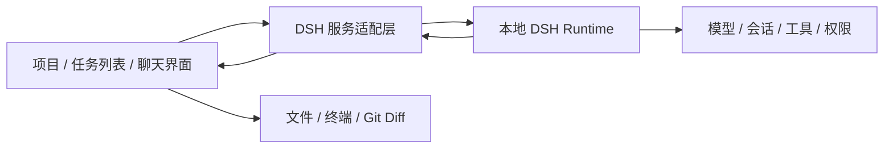

# Dcode 与 DeepSeek Harness 的融合

Dcode 将 ZCode 的桌面工作区能力与 DeepSeek Harness（DSH）的 Agent 执行能力连接起来。这里的「融合」指同一项目里的任务、消息、工具结果与文件工作区使用同一条真实执行链路，不只是换图标或嵌入一个独立聊天窗口。

DSH 是会话、消息、模型执行、工具调用和权限请求的事实来源。桌面服务层管理 DSH 的启动、停止、重启、健康检查和事件转发；UI 只保存当前工作区选择的会话 ID，并把 DSH 事件投影为聊天消息与执行记录。左侧任务列表和聊天面板共享该 ID，不创建第二套独立的聊天历史。切换项目时，旧项目迟到的响应不能写入新项目；应用或运行时重启后从 DSH 会话恢复。

文件操作与命令执行由 DSH 工具完成，Dcode 原有文件、终端和 Git/Diff 界面用于查看真实文件状态。工具卡片展示执行目标、状态及输出，文件变化仍应以磁盘和 Git Diff 为准。GitHub 云备份由独立服务负责，按项目当前磁盘内容制作快照，不依赖模型的口头声明。

当前桌面功能在 Windows 打包应用里用本地合成模型夹具通过了双会话、项目切换、重启恢复、停止继续、工具输出、文件编辑、Diff 和终端验收。这个测试证明桌面到运行时的本地链路，不证明某个在线模型账号或所有提供商已经实测。[模型供应商设置](DSH-MODEL-PROVIDER-SETTINGS.md) 复用 ZCode 的交互语言并保存到 DSH Profile。Dcode 的 MCP 设置由 DSH Profile 托管，详见 [MCP 接入](DSH-MCP-SERVERS.md)。ZCode 工作区和用户级 `.zcode/skills` 已通过 [DSH 技能提供器](DSH-ZCODE-SKILLS.md) 接入；已启用的 ZCode Markdown 自定义命令也可在 DSH 会话输入框调用，详见 [命令接入](DSH-ZCODE-COMMANDS.md)。其他 ZCode 插件扩展中的技能、记忆、子智能体、自动化及钩子设置尚未逐项验证能控制 DSH 执行，本地 DSH 工作区不把它们宣传为已贯通能力。

实现与契约可从 [DSH 运行时](../packages/dsh-runtime/CONTRACT.md)、[工作区会话](../packages/ui/src/dsh/CONTRACT.md) 和 [云备份](../packages/services/src/cloud-backup/CONTRACT.md) 开始阅读。移植代码的上游修订与许可证见 [PROVENANCE.md](../packages/dsh-runtime/vendor/PROVENANCE.md)。
